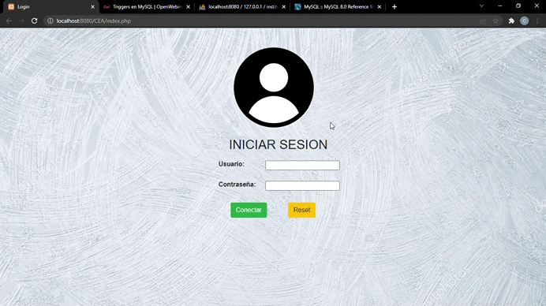

# Proyecto Instituto CEA

**Aplicacion para el Control de alumnos, profesores y cuotas por alumnos** Aplicativo local orientado en el control exacto de profesores, cursos a impartir, alumnos y las cuotas por alumno. Desarrollado a finales del 2019

## Instalación

Para instalar la esta aplicacion y ejecutarla deberá seguir los siguientes pasos:

 1. Clonar este repositorio ´git clone https://github.com/carloslobo09/Farmacia-Morillo.git´
 2. Instalar paquete Xampp
 3. Configurar Apache Server en puerto ´8080´
 4. Iniciar Apache y MySQL
 5. Leer lo que contiene la carpeta ´documentation´

## Dependencias
 1. [Bootstrap 3](https://getbootstrap.com/)
 2. [Jquery](https://https://jquery.com/)
 3. [PHP Excel](https://github.com/PHPOffice/PHPExcel)
 4. [XAMPP](https://www.apachefriends.org/es/index.html)
 5. [SweetAlert2](https://sweetalert2.github.io/)

 ## Experiencia

´A modo de proyecto final, debia buscar una entidad a la que pudiera aplicar los conocimientos adquiridos de programacion, analisis y documentacion. Como primer proyecto desarrollado por completo, soy consiente de que le faltan pulir muchas cosas. Originalmente el proyecto lo inicie con dos compañeros mas, por cuestiones que desconozco, a mitad del tiempo estimado de entrega del proyecto, tuve que continuar solo y recortar los objetivos primeramente planteados, a objetivos con los que pueda cumplir con la entrega final.´
